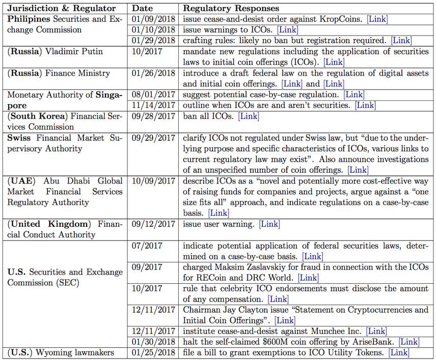
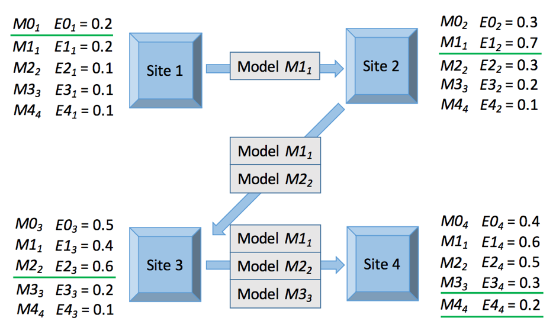

# ICO(Initial Coin Offering)의 이해와 프라이빗 블록체인(Private Blockchain)

제대로 된 ICO(Initial Coin Offering)란 어떤 것일까? 많은 ICO가 SCAM(사기)으로 간주되고, 해킹과 쏟아지는 악재에 위태로워 보이는 코인 시장(Coin Market)에서 기술적 기반을 딛고 서기란 쉬운 일이 아니다. ICO를 하는 기업의 입장에서도 백서(Whitepaper)에 밝혀 둔 로드맵과 기술 아키텍처의 한계로 인한 간극을 채우는게 쉬운 일이 아니다. 이번 칼럼에서는 제대로 된 ICO를 위한 지식들을 살펴보고자 한다.

## ICO(Initial Coin Offering)란 무엇일까? 

ICO를 이해하기 위해선 IPO를 먼저 이해해야 한다. IPO(Initial Public Offering)는 쉽게 생각하면 기업이 주식 시장에 상장하는 것이다. IPO를 통해 주식 시장에 공개된 후 대중들도 주식 거래에 참여할 수 있게끔 하는 것이 IPO의 핵심이다. 현존하는 모든 기업들의 주식을 우리가 거래할 수 있는 것은 아니다. 법으로 일정 요건을 채운 기업만이 주식 시장에 상장할 수 있기 때문이다. ICO는 이러한 맥락에서 등장했다. 주식 시장에 상장하기 어려운 기업들이 주식 대신 코인을 발행하면서 상장하기 시작했다. 엔젤투자자나 벤처캐피탈의 힘을 빌리지 않고도 자금을 공모할 수 있다는 점에서 수 많은 글로벌 스타트업들이 모색하고 있는 자금 조달 방식이다. 이런 모델을 통해 코닥은 브랜드 라이센스 비용만으로 500만 달러를 벌어들였다(Nikhilesh, 2018). 

<표 1> 각 국가별 ICO 규제 상황(J Li, 2018)

그런데 어째서 IPO는 괜찮고 ICO는 위험한 걸까? 기존 경제 시스템에는 시스템을 통제하는 하나의 중앙화 된 시스템이 있다. IPO는 법률로서 금융사기를 규정하고 기업들에게 책임을 부여하며, 외환 관리법을 통해 국가간 주식 거래에 대한 기준을 잡아준다. 하지만, ICO는 그렇지 않다. 아직까지는 투자자가 해당 기업의 건전성과 기술 실현성 등을 직접 검토해야만 한다. 전형적인 하이리스크 하이리턴 방식의 투자 방식이다. 때문에 대부분의 ICO 기업들은 일종의 사업계획서인 백서(Whitepaper)를 제공한다. 하지만, 이것만으로 충분할까? 이전 컬럼인 ‘욕망으로 읽어보는 블록체인’에서 언급했듯이, 블록체인 기반의 코인 이코노미는 결국에 법률과 중앙화된 시스템에 대한 신뢰를 블록체인 기술에 대한 신뢰로 갈음한다. 때문에 기술에 대한 안정성이나 이해가 전무한 상황에서 이루어지는 코인투자에 대해선 투기가 아니냐는 우려가 나올 수 밖에 없다. <표 1>에서처럼 우리나라가 유독 모든 ICO를 금지하는 이유는 바로 이러한 것들 때문이다. 

## 블록체인을 비즈니스에 접목하는 대표적인 세 가지 방향

가장 먼저, 그리고 빨리 적용할 수 있는 방법으로는 ICO에만 활용하는 방법을 들 수 있다. 이는 기존에 발행된 코인들의 메인넷을 활용하는 방식으로 비트코인, 이더리움, 이오스 등과 연계되는 토큰을 발행하고 이를 주식처럼 활용하는 방식이다. 예를 들어 이더리움의 경우, ERC20(Ethereum Request for Comment 20)이라는 토큰의 표준을 정의하고 스마트 컨트랙트(Smart contract)를 통해 새로운 코인을 만들 수 있도록 지원한다. 이를 Dapp(Decentralized Application)라고 하며 대부분의 이더리움 기반의 ICO에서 활용하는 방식이다. 

기존에 이미 스타트업 등을 통해서 운영 중인 서비스가 있는 기업들이 진행하기 좋은 방식이 Reverse ICO이다. 하지만, 이 방식은 비즈니스 로직 상에서 토큰이 차지하는 역할이 작아, 토큰의 가격이 상승할 여지를 만들기 어려우며, 지속적으로 토큰 수요를 창출하기 어렵다는 단점이 있다. 

다음으로, 블록체인이 반드시 비즈니스에 필요한 경우를 들 수 있다. 이는 실제 시스템에 블록체인을 쓰기전용 데이터베이스(Append only database)처럼 사용하면서 그 위에 비즈니스 로직이 올라가는 것이다. 분산 원장이 비즈니스 로직에 꼭 필요한 금융권에 많이 쓰이고 있다. 예를 들어, 하이퍼레저(Hyperledger) 등을 사용한 기업간 거래 시스템이나 원장 관리 시스템, KYC(Know Your Customer) 등의 인증 시스템 등 다양한 분야에 사용된다. 

끝으로 비즈니스와 ICO 두 군데에 모두 활용하는 경우를 들 수 있다. 가장 쉽게 생각할 수 있는 사례로는 컨텐츠 비즈니스를 생각할 수 있다. 컨텐츠의 이력이 블록체인 상에 올라가며, 해당 이력을 가진 사용자에게 보상으로 코인을 지급하는 한편, 해당 코인을 거래소에 상장시키는 방식이다. 이와 같은 방식을 사용하는 서비스로는 블로그 서비스 스팀잇(Steemit), 동영상 서비스 디튜브(dTube), 사진 서비스 피블(Pibble) 등을 들 수 있다.  

## 그래서 어떤 블록체인을 선택할 것인가? Private vs Public

비즈니스를 하는 사람들의 입장에서 블록체인을 도입하고자 한다면, 프라이빗(Private)과 퍼블릭(Public) 블록체인으로 구분되는 기술 갈래를 이해해야만 한다. 

일단, 퍼블릭 블록체인(Public Blockchain)은 블록체인 상에서 이루어지는 거래 행위의 참여자에 제한이 없는 방식이다. B2C 시장처럼, 공개된 다수가 거래 증명에 참여할 수 있으며, 이 과정에서 익명성을 부여할 수도 있다. 때문에 퍼블릭 블록체인은 성능이 이슈가 된다. 언제 어떤 사람들이 얼마만큼의 거래를 진행할지 알 수가 없기 때문이다. 초기에 블록체인을 활용한 비트코인은 이러한 설계상의 한계로 인해 실시간 지불이 필요한 ‘화폐’의 영역에서 동떨어 진 것이 아니냐는 지적을 받았다. 특히 거래가 빈번해야 하고 실시간에 가까운 응답속도를 보장해야 하는데 작업증명(PoW) 방식을 사용한다면, 어느 정도 중앙화되어 속도를 보장하는 마이닝 풀을 지니고 있는 퍼블릭 블록체인을 선택하거나 프라이빗 블록체인을 선택해야 한다. 

 

<그림 1> 정보 증명(Proof of Information) 알고리즘의 예시(Kuo, 2018)

프라이빗 블록체인(Private Blockchain)은 거래 검증과 참여에 인증된 사용자만 허가하는 방식으로 구현되는 블록체인이다. 일반적인 B2B 거래를 생각하면 쉽게 생각할 수 있다. 이미 허가된 사람들만 참여하는 거래이기 때문에 해킹에 대한 안정성이 퍼블릭 방식보다 상대적으로 높아 HSBN(High Security Business Network)를 구현하거나 EU가 최근 개정한 GDPR(General Data Protection Regulation) 등 보안 규정을 적용하기에도 용이하다. 지분증명(PoS)이나 작업증명(PoW) 방식에 비해 정보증명(PoI)방식으로 처리되어 성능 이슈에서도 어느 정도 자유롭다. 하지만, 퍼블릭과 비교했을 때, 익명성이나 탈중앙화 이슈가 비즈니스 모델과 직결된다면 어떤 부분까지 프라이빗으로 구현할지 고려해 보아야 한다. 

전반적으로 시장이 어지러운 상황이다. 굳이 마운틴 곡스 사태를 다시 언급하지 않더라도 이더리움, 비트코인 골드 해킹 의한 피해금액이 늘어나고 관련 시장이 위축되고 있다. 그럼에도 불구하고, 한편으로는 다양한 기업들이 여전히 블록체인과 ICO에 관심을 기울이고 있다. 이런 상황일수록, 변하지 않는 기술적 기반에 대해 공부하고 시간을 투자할 시점이 아닐까 생각해본다.  

## 참고문헌 

Kuo, T. T., & Ohno-Machado, L. (2018). ModelChain: Decentralized Privacy-Preserving Healthcare Predictive Modeling Framework on Private Blockchain Networks. arXiv preprint arXiv:1802.01746.

Li, J., & Mann, W. (2018). Initial coin offering and platform building.

Nikhilesh De(2018) Coindesk, Kodak Could Earn $5 Million for ICO Brand Licensing Deal, https://www.coindesk.com/kodak-earn-5-million-ico-brand-licensing-deal/ 

Disclaimer: 본 기고 글은 IBM Watson과 관계없이 블록체인과 토큰이코노미를 공부하는 한 개인으로서 작성된 글입니다. 본 글의 내용, 입장, 예측은 IBM을 대변하지 않습니다. 또한 본 ICO에 관한 컬럼은 개발자들을 대상으로 기술적인 검토를 위한 것으로 국내 ICO를 독려하는 글이 아닌, 글로벌 ICO에 대한 이해력을 높이기 위함임을 밝히는 바입니다.

출처: http://monthly-jiandson.tistory.com/13 [월간 지앤선]

